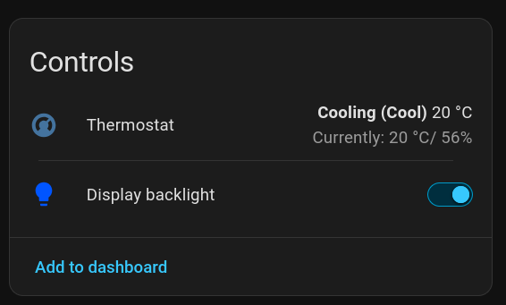
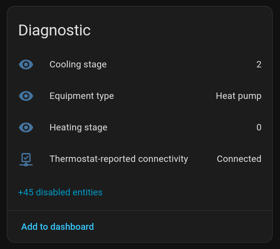
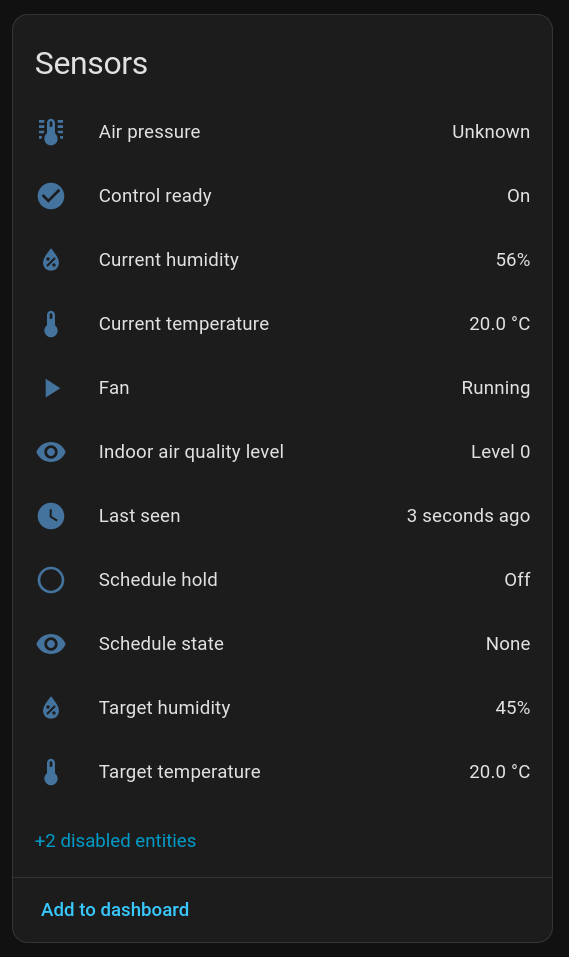
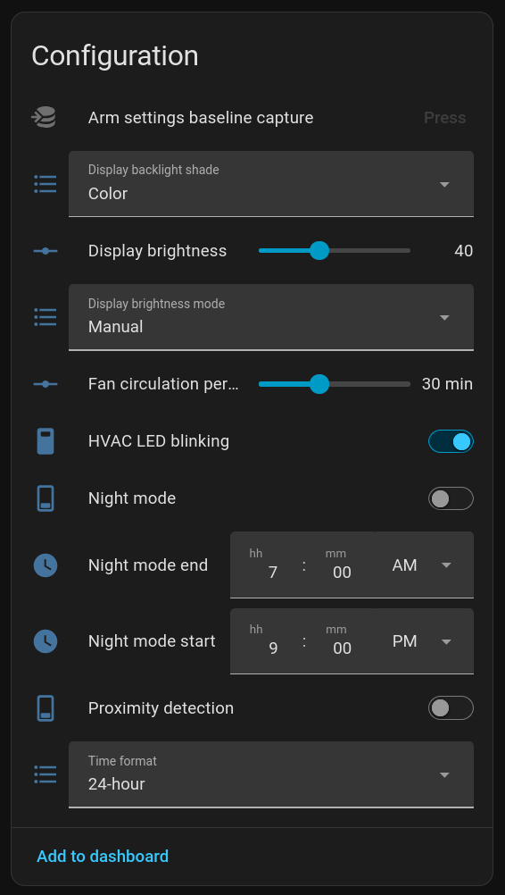
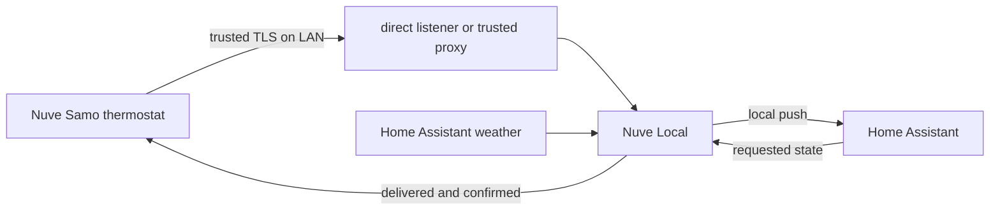

# Nuve Local

**Local Home Assistant support for the Nuve Samo thermostat.**

Nuve Local replaces the thermostat's vendor API endpoint with a listener on your
LAN. It adds climate controls, sensor data, display settings, diagnostics, and
Home Assistant Repairs without a Nuve account or cloud service.


## What you get

<p>
  
  
</p>
<p>
  
  
</p>

| Area | Home Assistant entities |
| --- | --- |
| Climate | Current and target temperature, Auto range, Cool/Heat/Auto/Off, and live heating/cooling action |
| Fan | Auto/On/Off, live fan activity, and circulation minutes per hour |
| Air | Humidity, target humidity, firmware IAQ level, and atmospheric pressure |
| HVAC | Equipment type, active stages, schedule/hold state, status LED, and last contact |
| Display | Backlight color and brightness, brightness mode, night mode, time format, and proximity wake |
| Health | Repairs for unsupported firmware, stale data, storage faults, uncertain commands, and schedule conflicts |
| Diagnostics | Firmware, controller temperature, Wi-Fi strength, and read-only installer settings; disabled by default |

Commands are not optimistic: Home Assistant waits for newer thermostat data before
reporting success. Writes stop when state is stale, incomplete, uncertain, or owned
by an active schedule.

The IAQ sensor reports only the firmware's `No reading` and levels 0–2. The protocol
does not provide a proven numerical gas reading, so Nuve Local does not create CO,
CO₂, eCO₂, or TVOC entities.

## Before you install

This is not a plug-and-play cloud login. Initial setup requires:

- a supported thermostat firmware version;
- root SSH access to back up and, when needed, redirect the thermostat;
- local DNS and firewall control;
- a hostname with a public TLS certificate; and
- Home Assistant 2026.7.4 or newer with access to `/config`.

Changing the API endpoint is persistent. Split DNS can avoid that edit when the
existing endpoint, port, path, and certificate all fit the local deployment.

Start with [Deployment and rollback](docs/deployment.md). It places backup and
network preparation before Home Assistant's five-minute pairing window. Control is
off by default and remains unavailable until the integration has a complete, current
starting state.

### Supported firmware

Nuve Local supports firmware `1.5.7.4`, `1.5.8`, and `1.6.1.1`. Version `1.5.8`
has also been tested on a thermostat. Other builds must be reviewed before use. See
[Version differences](docs/version-differences.md) for details.

## Install

Download the ZIP asset from the
[latest release](https://github.com/deftmartian/nuve-local/releases/latest)
and extract the complete component to:

```text
/config/custom_components/nuve_local/
```

Restart Home Assistant, then follow the [deployment guide](docs/deployment.md) before
adding the integration. Adding it starts the listener and opens the pairing window.

Always install every component file from one release. Do not combine versions.

## Not supported

Nuve Local does not expose:

- schedules, Vacation, or Emergency Heat controls;
- installer changes, locks/PINs, remote-sensor management, resets, or equipment
  tests;
- firmware update, recovery, hardware probes, or log transfer; or
- speaker volume, Celsius/Fahrenheit display, sleep logo, automatic clock, timezone,
  or DST controls.

These features either change too much state, lack safe confirmation, or have not
passed a reversible device test. The [field matrix](docs/field-matrix.md) records the
status of each recovered field.

## How it works



The listener checks source address, Host, serial, route, method, and device token.
In the recommended proxy setup, the proxy handles thermostat TLS and forwards to a
firewall-restricted HTTP listener. Direct TLS requires Home Assistant to serve a
trusted certificate and key.

Nuve Local makes no outbound requests and has no cloud fallback. The stock firmware
still contains its own update and manually triggered log-transfer code; the
integration does not call either path. See [Security and privacy](docs/security-privacy.md).

## Hardware and firmware research

[Thermostat platform](docs/thermostat-platform.md) is the best starting point for the
processor, memory, storage, radios, display, Linux/Qt stack, partitions, and
controller layout. Deeper references include:

- [Firmware architecture](docs/firmware-architecture.md)
- [Firmware evidence](docs/firmware-evidence.md)
- [API catalog](docs/api-contract-catalog.md)
- [Hardware and bus map](docs/hardware-bus-map.md)
- [Evidence ledger](docs/evidence-ledger.md)
- [Open questions](docs/remaining-unknowns.md)

Raw firmware, captures, password verifiers, device identifiers, and household
configuration are not stored in Git.

See the [documentation index](docs/README.md) for every research and subsystem page.

## Development

The project targets Python 3.14 and the pinned Home Assistant development
environment. Run the complete check with:

```bash
./scripts/check
```

Build the release archive with:

```bash
uv run python scripts/build_release.py
```

See [Maintenance](docs/maintenance.md) for release checks and packaging rules.

## License

Nuve Local is released under the [MIT License](LICENSE). Nuve and Nuve Samo are names
of their respective owner. This project is independent of and not endorsed by the
thermostat vendor.
